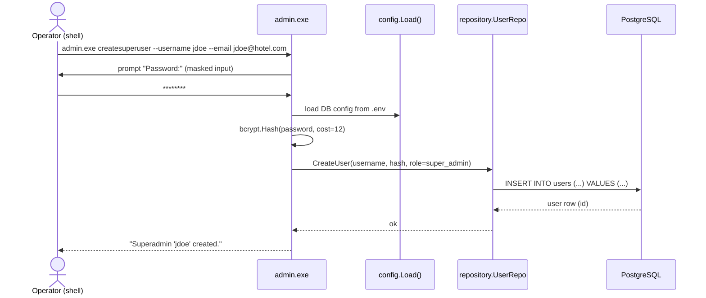
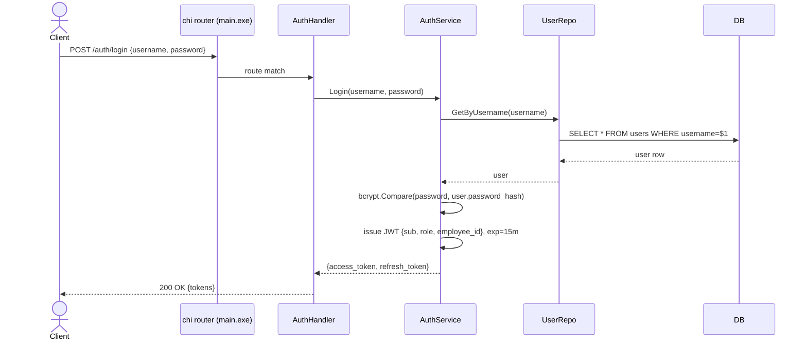
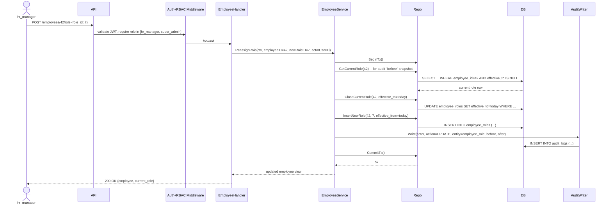
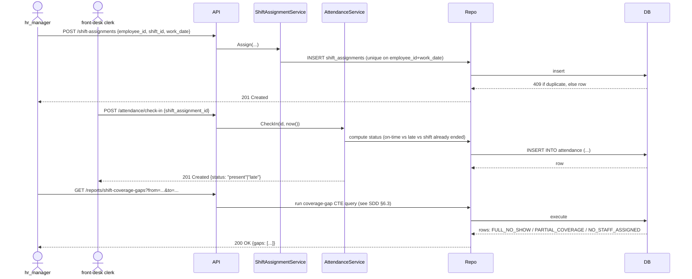

# APP FLOW — Hotel Employee Management System

Walkthroughs of the key flows end-to-end. Standalone renderable versions of each
diagram are in `docs/diagrams/*.mermaid`.

## 1. Superadmin Bootstrap (admin.exe — day zero, before any API traffic exists)

Note: no HTTP server involved. `admin.exe` never binds a port.

## 2. Login

## 3. Role Reassignment (multi-table write inside one transaction)

Why this is one transaction: an inconsistent state (old role closed, new role
insert failed) would silently leave an employee with *no* current role — a data
integrity bug, not just a UX one. Committing atomically prevents that.

## 4. Shift Assignment → Attendance → Report (the core operational loop)

## 5. Employee & RBAC State Notes
- An employee record can exist with `status='inactive'` without deleting history —
  attendance/role history for a terminated employee is preserved (soft-delete
  pattern on `employees.status`, hard FK constraints protect referential
  integrity elsewhere).
- `staff` role (if implemented) can only ever query `/employees/{id}/...` where
  `{id}` matches their own `employee_id` claim — enforced in the service layer,
  not just hidden in the UI, since there is no UI.
