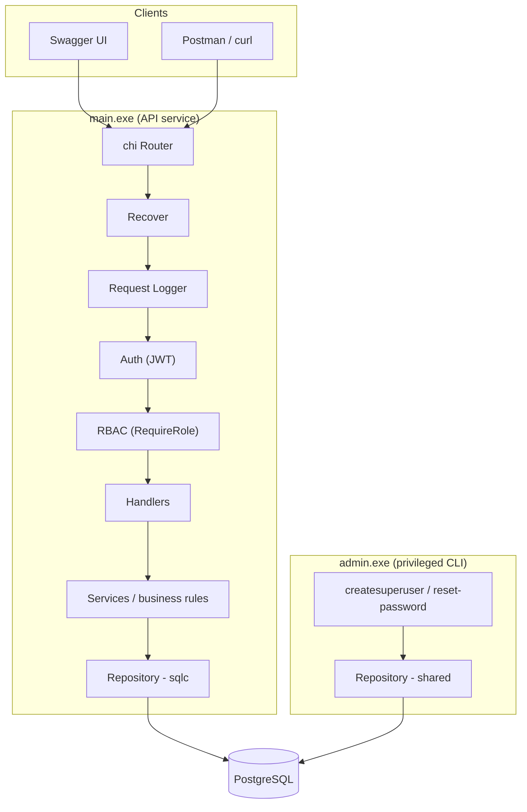
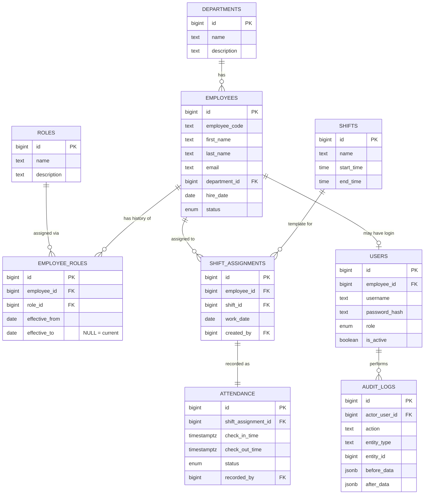

# Hotel Employee Management System — Backend

Go backend for managing hotel staff: employees, departments, roles, shifts, and
attendance — with JWT-based RBAC, audit logging, and a separate CLI for superadmin
bootstrap.

## Stack

Go 1.22 · chi (router) · sqlc (typed SQL) · goose (migrations) · PostgreSQL 16 ·
JWT + bcrypt (auth) · OpenAPI 3.0 + Swagger UI.

## Architecture



**Modular monolith** — one deployable service (`main.exe`) plus a separate privileged
CLI (`admin.exe`). Dependencies point inward only:

```
handler → service → repository (sqlc) → Postgres
```

- **handler**: HTTP concerns only — decode request, call service, encode response,
  map domain errors → HTTP status codes. No SQL, no business rules.
- **service**: business rules and transaction boundaries. Role reassignment is one
  service call that closes the old `employee_roles` row, opens a new one, writes the
  audit log — all in one DB transaction.
- **repository**: thin wrapper around sqlc-generated queries, implements interfaces
  defined in `domain` so services depend on an interface, not on sqlc directly.
- **domain**: plain Go structs/enums + repository interfaces. No sqlc types here.

## Database Design



**9 tables.** Key design choices:

- **Role history** — `employee_roles` is effective-dated (`effective_from` /
  `effective_to`), not a single mutable column. A partial unique index
  (`ux_employee_roles_current`) enforces exactly one current role per employee at
  the DB level — not just an application convention.
- **Attendance tied to assignments** — `attendance` references `shift_assignments`,
  not directly employee+date. This is what makes the shift-coverage report able to
  detect "assigned but never checked in" — a case a naive query on `attendance`
  alone would miss.
- **Audit trail** — append-only `audit_logs` with JSONB before/after snapshots,
  written atomically inside the same transaction as the mutation.

## Key Decisions

| Decision | Rationale |
|---|---|
| **sqlc over ORM** | Full control over non-trivial report queries. Compile-time-checked SQL, no hidden N+1s. |
| **Separate admin.exe** | The only way to mint a `super_admin` is via CLI with DB access. The API explicitly refuses to create or promote to `super_admin`, even for an authenticated super_admin caller. |
| **Audit in service layer** | Captures true before/after domain state, not just the raw HTTP request body. Commits atomically with the mutation. |
| **No microservices** | One database, one service — matches the actual scale. A message queue or separate services would be unjustified. |

## Running Locally

### With Docker (recommended)

```bash
cp .env.example .env
docker compose up --build          # Postgres + API, migrations run on startup

# In another shell — create the first superadmin (one-time)
docker compose run --rm admin createsuperuser

# Open Swagger UI
open http://localhost:8080/docs
```

### Without Docker

**Prerequisites:** Go 1.22+, PostgreSQL 16+

```bash
# 1. Create the database role and database
psql -U postgres -h localhost -c "CREATE ROLE hotel WITH LOGIN PASSWORD 'hotel';"
psql -U postgres -h localhost -c "CREATE DATABASE hotel_ems OWNER hotel;"

# 2. Run the schema migration
psql -U hotel -h localhost -d hotel_ems -f migrations/001_init.sql

# 3. Configure environment and start the API
cp .env.example .env               # edit DATABASE_URL if your Postgres host/port differs
make run                           # API on :8080

# 4. Create the first superadmin (one-time)
go run ./cmd/admin createsuperuser
```

### Useful Commands

```bash
make build             # build both binaries to bin/
make test              # run all tests
make test-integration  # integration tests (needs live DB)
make sqlc              # regenerate sqlc code

# Add a new migration
goose -dir migrations postgres "$DATABASE_URL" create add_something sql
```

## Project Layout

```
cmd/api/main.go          → HTTP server entrypoint
cmd/admin/main.go        → CLI entrypoint
internal/
  config/config.go       → env loading, typed Config struct
  db/db.go               → pgxpool connection helper
  db/queries/queries.sql → sqlc source queries
  db/sqlc/               → generated Go code (models, queries, querier)
  domain/                → entities, enums, errors, repository interfaces
  repository/            → sqlc-backed implementations of domain interfaces
  service/               → business rules, validation, transaction boundaries
  handler/               → chi HTTP handlers, request/response DTOs
  middleware/            → auth (JWT), RBAC, logger, recover
  audit/audit.go         → audit log writer
  auth/auth.go           → JWT issue/verify, bcrypt hash/check
migrations/              → goose SQL migrations
openapi/openapi.yaml     → OpenAPI 3.0 spec
```

## API Endpoints

| Resource | Endpoints | RBAC |
|---|---|---|
| Auth | `POST /auth/login`, `POST /auth/refresh` | Public |
| Employees | `GET/POST /employees`, `GET/PUT/DELETE /employees/{id}`, `POST /employees/{id}/department`, `POST /employees/{id}/role` | hr_manager, super_admin |
| Departments | `GET/POST /departments`, `GET/PUT/DELETE /departments/{id}` | hr_manager, super_admin |
| Roles | `GET/POST /roles`, `GET/PUT/DELETE /roles/{id}` | hr_manager, super_admin |
| Shifts | `GET/POST /shifts`, `GET/PUT/DELETE /shifts/{id}` | hr_manager, super_admin |
| Shift Assignments | `GET/POST /shift-assignments`, `DELETE /shift-assignments/{id}`, `GET /employees/{id}/shifts` | hr_manager, super_admin |
| Attendance | `POST /attendance/check-in`, `POST /attendance/check-out`, `GET /employees/{id}/attendance` | hr_manager, super_admin |
| Reports | `GET /reports/attendance-summary`, `GET /reports/department-staffing`, `GET /reports/shift-coverage-gaps` | hr_manager, super_admin |
| Users | `GET/POST /users`, `GET/PUT/DELETE /users/{id}` | super_admin |
| Audit Logs | `GET /audit-logs` | super_admin, hr_manager |

Full contract: `openapi/openapi.yaml` — browsable at `/docs` when the API is running.

## Reports

Three report endpoints. The shift-coverage-gap report is the genuinely non-trivial one:

```sql
-- Combines a generated date series × all shifts, anti-joined against actual
-- assignments + attendance to surface:
--   NO_STAFF_ASSIGNED  — shift template with zero employees assigned
--   FULL_NO_SHOW       — everyone assigned was absent
--   PARTIAL_COVERAGE   — some showed, some didn't
```

A naive `SELECT * FROM attendance WHERE status='absent'` would miss the case where
**no attendance row exists at all**. Full query and explanation in `Docs/SDD.md`.

## Security

- **Passwords**: bcrypt, cost 12
- **JWT**: short-lived access token (15m) + refresh token (7d), secret from env
- **SQL injection**: not applicable — sqlc generates parameterized queries only
- **Privilege escalation**: API rejects creating/promoting to `super_admin`
- **Audit trail**: append-only, no update/delete endpoint exposed

## Documentation

| Doc | Description |
|---|---|
| [PRD](Docs/PRD.md) | Product requirements and scope |
| [SDD](Docs/SDD.md) | Software design — data model, API surface, reports, auth |
| [ARCHITECTURE](Docs/ARCHITECTURE.md) | Why the layers exist, transaction boundaries, security |
| [APP_FLOW](Docs/APP_FLOW.md) | Sequence diagrams for key flows |
