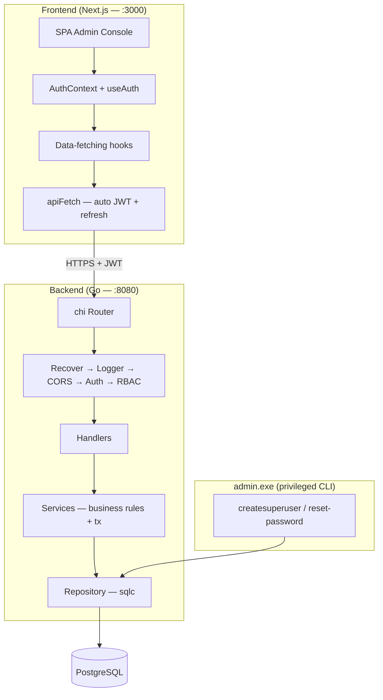
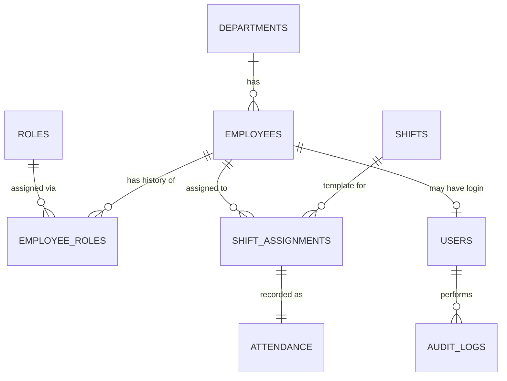

# Hotel Employee Management System

A full-stack system for managing hotel staff — employees, departments, roles, shifts,
and attendance — with a Go backend API, JWT-based RBAC, audit logging, and a Next.js
admin console frontend.

## Tech Stack

| Layer | Choice |
|---|---|
| **Frontend** | Next.js 16, React 19, TypeScript, Tailwind CSS, shadcn/ui |
| **API client** | Native `fetch` with auto JWT attach + 401 refresh |
| **Backend** | Go 1.25, chi router, sqlc (typed SQL), goose (migrations) |
| **Database** | PostgreSQL 16 |
| **Auth** | JWT (HS256) + bcrypt |
| **API docs** | OpenAPI 3.0 + Swagger UI at `/docs` |

## Architecture



**Modular monolith** — one deployable service (`main.exe`) plus a separate privileged
CLI (`admin.exe`). Dependencies point inward: `handler → service → repository → Postgres`.
The service layer owns transaction boundaries and business rules.

## Database Design



9 tables. Key design choices:

- **Role history** — `employee_roles` is effective-dated (not a mutable column), so
  "who held what role when" is answerable. A partial unique index enforces exactly
  one current role per employee at the DB level.
- **Attendance tied to assignments** — attendance always references a
  `shift_assignment` (not directly employee+date), enabling the shift coverage report
  to detect "assigned but never checked in" — a case a naive query on `attendance`
  alone would miss.
- **Audit trail** — append-only `audit_logs` with JSONB before/after snapshots,
  written atomically inside the same transaction as the mutation.

## Key Decisions

| Decision | Rationale |
|---|---|
| **sqlc over ORM** | Full control over non-trivial report queries; compile-time-checked SQL, no hidden N+1s. |
| **Separate admin.exe** | The only way to mint a `super_admin` is via CLI with DB access — the API explicitly rejects creating/promoting to `super_admin`. |
| **Audit in service layer** | Captures true before/after domain state, not just the raw HTTP request body. Commits atomically with the mutation. |
| **No microservices** | One database, one service — matches the actual scale. A message queue would be unjustified. |
| **SPA over Next.js pages** | The admin console is a single-page app with client-side routing — simpler state, fewer route round-trips. |
| **JWT in localStorage** | Stateless auth, auto-refresh on 401. Tokens never stored in cookies to avoid CSRF complexity. |

## Running Locally

### Quick start (3 terminals)

**Terminal 1 — Database & Backend:**
```bash
cd Backend
cp .env.example .env
docker compose up --build          # Postgres + API on :8080, migrations run on startup
```

**Terminal 2 — Create the first superadmin (one-time):**
```bash
cd Backend
docker compose run --rm admin createsuperuser
```

**Terminal 3 — Frontend:**
```bash
cd Frontend
cp .env.example .env.local
bun install
bun dev                            # Admin console on :3000
```

Then open:
- Admin console: `http://localhost:3000`
- Swagger UI: `http://localhost:8080/docs`

### Without Docker

**Prerequisites:** Go 1.22+, PostgreSQL 16+, Bun (or Node 18+)

**Backend:**
```bash
# 1. Create the database and role
psql -U postgres -h localhost -c "CREATE ROLE hotel WITH LOGIN PASSWORD 'hotel';"
psql -U postgres -h localhost -c "CREATE DATABASE hotel_ems OWNER hotel;"

# 2. Run the migration
psql -U hotel -h localhost -d hotel_ems -f Backend/migrations/001_init.sql

# 3. Configure and run
cd Backend
cp .env.example .env               # edit DATABASE_URL if your Postgres is different
make run                           # API on :8080

# 4. Create the first superadmin (one-time)
go run ./cmd/admin createsuperuser
```

**Frontend:**
```bash
cd Frontend
cp .env.example .env.local
bun install
bun dev                            # Admin console on :3000
```

## API Endpoints

| Resource | Endpoints |
|---|---|
| Auth | `POST /auth/login`, `POST /auth/refresh` |
| Dashboard | `GET /dashboard` |
| Employees | `GET/POST /employees`, `GET/PUT/DELETE /employees/{id}`, `POST /employees/{id}/department`, `POST /employees/{id}/role` |
| Departments | `GET/POST /departments`, `GET/PUT/DELETE /departments/{id}` |
| Roles | `GET/POST /roles`, `GET/PUT/DELETE /roles/{id}` |
| Shifts | `GET/POST /shifts`, `GET/PUT/DELETE /shifts/{id}` |
| Shift Assignments | `GET/POST /shift-assignments`, `DELETE /shift-assignments/{id}`, `GET /employees/{id}/shifts` |
| Attendance | `POST /attendance/check-in`, `POST /attendance/check-out`, `GET /employees/{id}/attendance` |
| Reports | `GET /reports/attendance-summary`, `GET /reports/department-staffing`, `GET /reports/shift-coverage-gaps` |
| Users | `GET/POST /users`, `GET/PUT/DELETE /users/{id}` *(super_admin only)* |
| Audit Logs | `GET /audit-logs` *(super_admin + hr_manager)* |

Full contract: `Backend/openapi/openapi.yaml` — browsable at `/docs` when the API is running.

## Reports

Three report endpoints. The shift-coverage-gap report is the non-trivial one — it
combines a generated date series with an anti-join to surface:

- **NO_STAFF_ASSIGNED** — shift template with zero employees assigned
- **FULL_NO_SHOW** — everyone assigned was absent
- **PARTIAL_COVERAGE** — some assigned employees showed, some didn't

A naive `SELECT * FROM attendance WHERE status='absent'` would miss the case where
**no attendance row exists at all**.

## Project Structure

```
Backend/
  cmd/api/         → HTTP server entrypoint
  cmd/admin/       → CLI entrypoint (createsuperuser, reset-password)
  internal/
    config/        → env loading
    db/            → connection pool + sqlc generated code
    domain/        → entities, enums, repository interfaces (ports)
    repository/    → sqlc-backed implementations
    service/       → business rules + transaction boundaries
    handler/       → HTTP handlers + request/response DTOs
    middleware/    → auth, RBAC, logger, recover
    audit/         → audit log writer
    auth/          → JWT + bcrypt
  migrations/      → goose SQL migrations
  openapi/         → OpenAPI 3.0 spec
  Docs/            → PRD, SDD, ARCHITECTURE, APP_FLOW

Frontend/
  src/
    app/           → Next.js app router (login page, root layout)
      login/       → standalone login page
    components/
      hems/        → 16 custom business components (Dashboard, Employees, etc.)
      ui/          → shadcn/ui primitives
    hooks/         → React hooks (useAuth, useEmployees, useDashboard, ...)
    lib/
      api.ts       → apiFetch client with JWT auto-refresh
      types.ts     → TypeScript types aligned with backend Go models
      utils.ts     → cn() helper
  .env.example     → NEXT_PUBLIC_API_URL config
```

## Documentation

| Doc | Description |
|---|---|
| [Backend PRD](Backend/Docs/PRD.md) | Product requirements and scope |
| [Backend SDD](Backend/Docs/SDD.md) | Software design — data model, API surface, reports, auth |
| [Backend ARCHITECTURE](Backend/Docs/ARCHITECTURE.md) | Why the layers exist, transaction boundaries, security |
| [Backend APP_FLOW](Backend/Docs/APP_FLOW.md) | Sequence diagrams for key flows |
